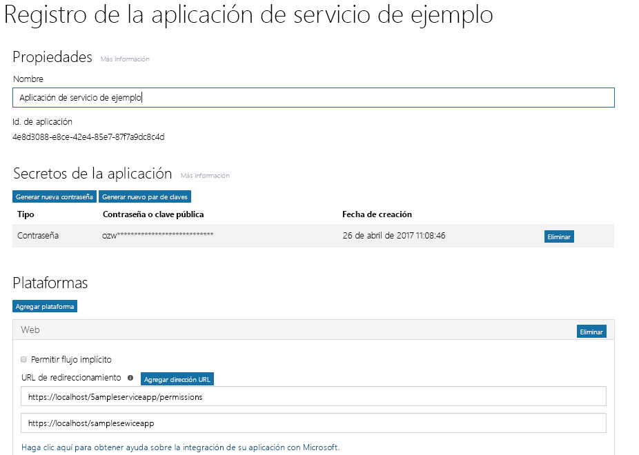
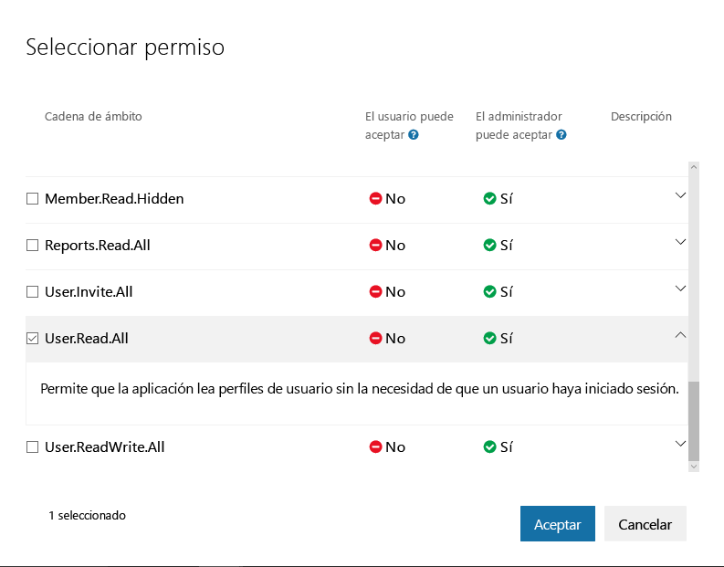
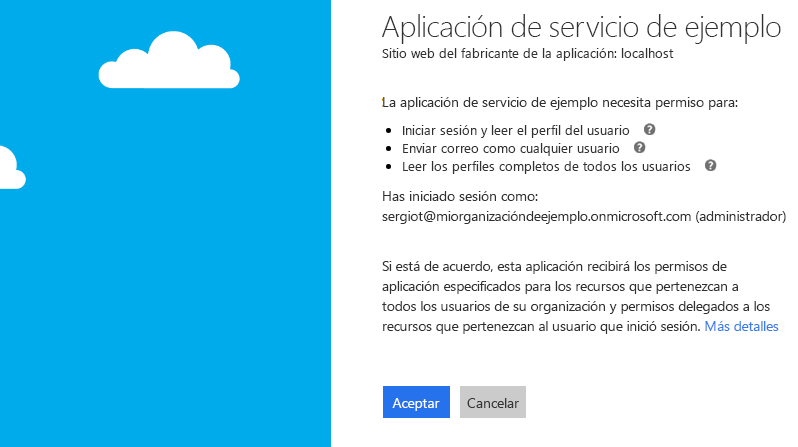

# <a name="get-access-without-a-user"></a>Obtener acceso sin un usuario
Algunas aplicaciones se ejecutan en un servidor sin que haya un usuario presente. Estos tipos de aplicaciones suelen denominarse servicios en segundo plano o demonios. Un ejemplo de una aplicación de este tipo podría ser un servicio de archivado de correo electrónico que se activa y se ejecuta de noche. Los servicios en segundo plano suelen usar el flujo de concesión de credenciales de cliente de OAuth 2.0 para obtener tokens de acceso de Azure AD. En este tema, veremos los pasos básicos para configurar un servicio en segundo plano y usar el flujo de concesión de credenciales de cliente de OAuth para obtener un token de acceso de Azure AD para llamar a Microsoft Graph. 

## <a name="authentication-and-authorization-steps"></a>Pasos de autenticación y autorización
Los pasos básicos necesarios para autenticar un servicio en segundo plano y obtener un token del punto de conexión de Azure AD v2.0 para realizar llamadas a Microsoft Graph son los siguientes:

1. Registrar la aplicación.
2. Configurar los permisos de Microsoft Graph.
3. Obtener el consentimiento del administrador.
4. Obtener un token de acceso.
5. Usar el token de acceso para llamar a Microsoft Graph.

## <a name="1-register-your-app"></a>1. Registrar la aplicación
Para autenticarse con el punto de conexión de Azure v2.0, primero debe registrar la aplicación en el [Portal de registro de aplicaciones de Microsoft](https://apps.dev.microsoft.com/). Puede usar una cuenta de Microsoft o una cuenta profesional o educativa para registrar la aplicación. 

En la captura de pantalla siguiente se muestra el registro de una aplicación web que se ha configurado para un servicio en segundo plano. 

En el caso de un servicio en segundo plano, debe registrar la aplicación para la plataforma web y copiar los valores siguientes:

- El identificador de la aplicación asignado por el portal de registro de aplicaciones.
- Un secreto de la aplicación, ya sea una contraseña o un par de claves pública y privada (certificado).
- Una dirección URL de redireccionamiento para que el servicio reciba respuestas de token de Azure AD.
- Una dirección URL de redireccionamiento para que el servicio reciba respuestas de consentimiento del administrador si la aplicación implementa la funcionalidad para solicitar el consentimiento del administrador.  

Para conocer los pasos necesarios para configurar una aplicación mediante el Portal de registro de aplicaciones de Microsoft, vea [Registrar una aplicación](./auth_register_app_v2.md).

Con el flujo de concesión de credenciales de cliente de OAuth 2.0, la aplicación se autentica directamente en el punto de conexión `/token` de Azure AD v2.0 mediante el identificador de aplicación asignado por Azure AD y el secreto de aplicación que ha creado en el portal. 

## <a name="2-configure-permissions-for-microsoft-graph"></a>2. Configurar los permisos de Microsoft Graph
Para las aplicaciones que se ejecutan sin un usuario, Microsoft Graph expone los permisos de la aplicación. (Microsoft Graph también expone los permisos delegados para aplicaciones que se ejecutan en nombre de un usuario). Se configuran previamente los permisos de la aplicación que su aplicación necesita al registrar la aplicación. Los permisos de la aplicación siempre requieren el consentimiento del administrador. Los administradores pueden dar su consentimiento a estos permisos mediante [Azure Portal](https://portal.azure.com) cuando la aplicación se instala en la organización o mediante la experiencia de registro en la aplicación que usted proporcione para que los administradores acepten los permisos que haya configurado. Una vez que Azure AD registra el consentimiento del administrador, la aplicación puede solicitar tokens sin tener que volver a solicitar su consentimiento. Para obtener más información sobre los permisos disponibles con Microsoft Graph, vea la [Referencia de permisos](./permissions_reference.md).

Para configurar los permisos de la aplicación en el [Portal de registro de aplicaciones de Microsoft](https://apps.dev.microsoft.com/): en **Microsoft Graph**, seleccione **Agregar** junto a **Permisos de la aplicación** y, después, seleccione los permisos que requiere la aplicación en el cuadro de diálogo **Seleccionar permisos**.

En la siguiente captura de pantalla se muestra el cuadro de diálogo **Seleccionar permisos** para los permisos de aplicación de Microsoft Graph. 



> **Importante**: Se recomienda configurar el conjunto de permisos con los privilegios mínimos que requiere la aplicación. Esto proporciona una experiencia mucho más cómoda para los administradores que tener que dar su consentimiento a una larga lista de permisos.
>

## <a name="3-get-administrator-consent"></a>3. Obtener el consentimiento del administrador
Puede confiar en que un administrador conceda los permisos que la aplicación necesita en [Azure Portal](https://portal.azure.com), pero generalmente es mejor proporcionar una experiencia de registro para los administradores mediante el punto de conexión `/adminconsent` de Azure AD v2.0. 

### <a name="request"></a>Solicitud
```
// Line breaks are for legibility only.

GET https://login.microsoftonline.com/{tenant}/adminconsent?
client_id=6731de76-14a6-49ae-97bc-6eba6914391e
&state=12345
&redirect_uri=http://localhost/myapp/permissions
```

| Parámetro | Condición | Descripción |
| --- | --- | --- |
| tenant |Obligatorio |Inquilino de directorio al que quiere solicitar permiso. Puede estar en formato GUID o de nombre descriptivo. Si no sabe a qué inquilino pertenece el usuario y quiere permitir que inicie sesión con cualquier inquilino, use `common`. |
| client_id |Obligatorio |Identificador de aplicación que el [portal de registro de aplicaciones](https://apps.dev.microsoft.com/) ha asignado a la aplicación. |
| redirect_uri |Obligatorio |URI de redireccionamiento adonde quiere que se envíe la respuesta para que la aplicación la controle. Debe coincidir exactamente con uno de los URI de redireccionamiento que ha registrado en el portal, pero con codificación URL, y puede tener segmentos de ruta de acceso adicionales. |
| state |Recomendado |Valor incluido en la solicitud que también se devuelve en la respuesta de token. Puede ser una cadena con cualquier contenido que quiera. El estado se usa para codificar la información sobre el estado del usuario en la aplicación antes de que se produjese la solicitud de autenticación, como la página o la visualización en la que estaba. |

### <a name="consent-experience"></a>Experiencia de consentimiento
Azure AD exige que solo pueda iniciar sesión un administrador de inquilinos para completar la solicitud. Se le pedirá al administrador que apruebe todos los permisos de aplicación que se han solicitado para la aplicación en el portal de registro de aplicaciones. A continuación se incluye un ejemplo del cuadro de diálogo de consentimiento que Azure AD muestra al administrador:



### <a name="response"></a>Respuesta
Si el administrador aprueba los permisos de la aplicación, la respuesta correcta tiene un aspecto similar al siguiente:

```
GET http://localhost/myapp/permissions?tenant=a8990e1f-ff32-408a-9f8e-78d3b9139b95&state=state=12345&admin_consent=True
```

| Parámetro | Descripción |
| --- | --- |
| tenant |Inquilino de directorio que ha concedido a la aplicación los permisos que ha solicitado, en formato GUID. |
| state |Valor incluido en la solicitud que también se devuelve en la respuesta de token. Puede ser una cadena con cualquier contenido que quiera. El estado se usa para codificar la información sobre el estado del usuario en la aplicación antes de que se produjese la solicitud de autenticación, como la página o la visualización en la que estaba. |
| admin_consent |Establecido en **true**. |


> **Probar** Puede probarlo usted mismo si pega la solicitud siguiente en un explorador. Si inicia sesión como administrador global para un inquilino de Azure AD, aparecerá el cuadro de diálogo de consentimiento de administrador para la aplicación. (Será una aplicación diferente de la que se muestra en la anterior captura de pantalla con el cuadro de diálogo de consentimiento).
> 

```
https://login.microsoftonline.com/common/adminconsent?client_id=6731de76-14a6-49ae-97bc-6eba6914391e&state=12345&redirect_uri=http://localhost/myapp/permissions
```

## <a name="4-get-an-access-token"></a>4. Obtener un token de acceso
En el flujo de concesión de credenciales de cliente de OAuth 2.0, se usan los valores del identificador de aplicación y el secreto de aplicación que se guardaron al registrar la aplicación para solicitar un token de acceso directamente del punto de conexión `/token` de Azure AD v2.0.

Para especificar los permisos configurados previamente, se pasa `https://graph.microsoft.com/.default` como valor del parámetro `scope` en la solicitud de token. Vea la descripción del parámetro `scope` en la solicitud de token siguiente para obtener más información.

### <a name="token-request"></a>Solicitud de token
Se envía una solicitud POST al punto de conexión `/token` de v2.0 para adquirir un token de acceso:

```
POST /{tenant}/oauth2/v2.0/token HTTP/1.1
Host: login.microsoftonline.com
Content-Type: application/x-www-form-urlencoded

client_id=535fb089-9ff3-47b6-9bfb-4f1264799865&scope=https%3A%2F%2Fgraph.microsoft.com%2F.default&client_secret=qWgdYAmab0YSkuL1qKv5bPX&grant_type=client_credentials
```

| Parámetro | Condición | Descripción |
| --- | --- | --- |
| tenant |Obligatorio |Inquilino de directorio al que quiere solicitar permiso. Puede estar en formato GUID o de nombre descriptivo. |
| client_id |Obligatorio |Identificador de aplicación que el [portal de registro de aplicaciones de Microsoft](https://apps.dev.microsoft.com) ha asignado al registrar la aplicación. |
| scope |Obligatorio |El valor pasado para el parámetro `scope` en esta solicitud debe ser el identificador de recurso (URI del identificador de aplicación) del recurso que le interesa, con el sufijo `.default` anexado. Para Microsoft Graph, el valor es `https://graph.microsoft.com/.default`. Este valor le indica al punto de conexión de v2.0 que, de todos los permisos de aplicación que se han configurado para la aplicación, debe emitir un token para los que están asociados al recurso que quiere usar. |
| client_secret |Obligatorio |Secreto de la aplicación generado para la aplicación en el portal de registro de aplicaciones. |
| grant_type |Obligatorio |Debe ser `client_credentials`. |

#### <a name="token-response"></a>Respuesta de token
Una respuesta correcta tiene un aspecto similar al siguiente:

```
{
  "token_type": "Bearer",
  "expires_in": 3599,
  "access_token": "eyJ0eXAiOiJKV1QiLCJhbGciOiJSUzI1NiIsIng1dCI6Ik1uQ19WWmNBVGZNNXBP..."
}
```

| Parámetro | Descripción |
| --- | --- |
| access_token |Token de acceso solicitado. La aplicación puede usar este token en las llamadas a Microsoft Graph. |
| token_type |Indica el valor de tipo del token. El único tipo que Azure AD admite es `bearer`. |
| expires_in |Período de validez del token de acceso (en segundos). |

## <a name="5-use-the-access-token-to-call-microsoft-graph"></a>5. Usar el token de acceso para llamar a Microsoft Graph

Una vez que tenga un token de acceso, puede usarlo para llamar a Microsoft Graph. Para ello, inclúyalo en el encabezado `Authorization` de una solicitud. Mediante la solicitud siguiente se obtiene el perfil de un usuario específico. La aplicación debe tener el permiso _User.Read.All_ para llamar a esta API.

```
GET https://graph.microsoft.com/v1.0/user/12345678-73a6-4952-a53a-e9916737ff7f 
Authorization: Bearer eyJ0eXAiO ... 0X2tnSQLEANnSPHY0gKcgw
Host: graph.microsoft.com

```
Una respuesta correcta tendrá un aspecto similar al siguiente (se han quitado algunos encabezados de respuesta):

```
HTTP/1.1 200 OK
Content-Type: application/json;odata.metadata=minimal;odata.streaming=true;IEEE754Compatible=false;charset=utf-8
request-id: f45d08c0-6901-473a-90f5-7867287de97f
client-request-id: f45d08c0-6901-473a-90f5-7867287de97f
OData-Version: 4.0
Duration: 309.0273
Date: Wed, 26 Apr 2017 19:53:49 GMT
Content-Length: 407

{
    "@odata.context":"https://graph.microsoft.com/v1.0/$metadata#users/$entity",
    "id":"12345678-73a6-4952-a53a-e9916737ff7f",
    "businessPhones":[
        "+1 555555555"
    ],
    "displayName":"Chris Green",
    "givenName":"Chris",
    "jobTitle":"Software Engineer",
    "mail":null,
    "mobilePhone":"+1 5555555555",
    "officeLocation":"Seattle Office",
    "preferredLanguage":null,
    "surname":"Green",
    "userPrincipalName":"ChrisG@contoso.onmicrosoft.com"
}
```

## <a name="supported-app-scenarios-and-resources"></a>Escenarios de aplicación admitidos y recursos
Los servicios en segundo plano se ejecutan en un servidor sin que un usuario haya iniciado sesión y usan la concesión de credenciales de cliente de OAuth 2.0 para autenticarse con Azure AD y obtener un token. En el caso del punto de conexión de v2.0, puede explorar en profundidad este escenario con los recursos siguientes:

- Para consultar un tratamiento más completo del flujo de concesión de credenciales de cliente que también incluye las respuestas de error, vea [Azure Active Directory v2.0 y el flujo de credenciales de cliente de OAuth 2.0](https://docs.microsoft.com/azure/active-directory/develop/active-directory-v2-protocols-oauth-client-creds). 
- Para obtener un ejemplo que llama a Microsoft Graph desde un servicio, vea el [ejemplo de demonio de v2.0](https://github.com/Azure-Samples/active-directory-dotnet-daemon-v2) en GitHub.
- Para obtener más información sobre las bibliotecas de autenticación de Microsoft y de terceros recomendadas para Azure AD v2.0, vea [Bibliotecas de autenticación de Azure Active Directory v2.0](https://docs.microsoft.com/azure/active-directory/develop/active-directory-v2-libraries).

## <a name="azure-ad-endpoint-considerations"></a>Consideraciones sobre el punto de conexión de Azure AD
Si usa el punto de conexión de Azure AD, existen algunas diferencias en la forma en que se configura la aplicación y la forma en que se inicia sesión en Azure AD:

- Para configurar la aplicación, se usa [Azure Portal](https://portal.azure.com). Para obtener más información sobre cómo configurar aplicaciones con Azure Portal, vea [Integración de aplicaciones con Azure Active Directory: Agregar una aplicación](https://docs.microsoft.com/azure/active-directory/develop/active-directory-integrating-applications#adding-an-application).
- Si la aplicación es multiinquilino, debe configurarla explícitamente para que sea multiinquilino en [Azure Portal](https://portal.azure.com).
- No hay ningún punto de conexión de consentimiento del administrador (`/adminconsent`). En su lugar, la aplicación puede solicitar el consentimiento del administrador en tiempo de ejecución mediante la adición del parámetro `prompt=admin_consent` a una solicitud de autorización. Para obtener más información, vea **Desencadenamiento del marco de consentimiento de Azure AD en tiempo de ejecución** en [Integración de aplicaciones con Azure Active Directory](https://docs.microsoft.com/azure/active-directory/develop/active-directory-integrating-applications).
- Los parámetros de las solicitudes de autorización y de token son diferentes. Por ejemplo, no hay ningún parámetro `scope` en las solicitudes del punto de conexión de Azure AD. En su lugar, se usa el parámetro `resource` para especificar el URI del recurso (`resource=https://graph.microsoft.com`) para el que se solicita autorización (para el consentimiento del administrador) o un token.

En el caso del punto de conexión de Azure AD, puede explorar en profundidad este escenario con los recursos siguientes:

- Para obtener vínculos rápidos a información general, ejemplos y un tratamiento detallado del flujo de concesión de credenciales de cliente, vea **Service-to-Service** en la sección **Introducción** de [Azure Active Directory para desarrolladores](https://docs.microsoft.com/azure/active-directory/develop/active-directory-developers-guide).
- En el caso del punto de conexión de Azure AD, puede usar la Biblioteca de autenticación de Azure Active Directory (ADAL) para obtener los tokens de Azure AD. ADAL está disponible para varias plataformas, entre las que se incluyen .NET, iOS, Android, JavaScript, Java y Node.js. Para obtener más información sobre ADAL y otras bibliotecas de autenticación de Microsoft para el punto de conexión de Azure AD, vea [Bibliotecas de autenticación de Azure Active Directory](https://docs.microsoft.com/azure/active-directory/develop/active-directory-authentication-libraries). 

 