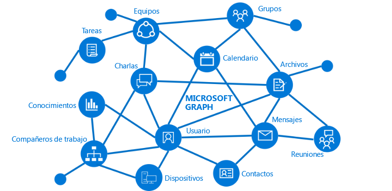

# Información general de Microsoft Graph

Puede usar la API de Microsoft Graph para interactuar con los datos de millones de usuarios en la nube de Microsoft. Use Microsoft Graph para compilar aplicaciones para organizaciones y consumidores que se conectan a una gran cantidad de recursos, relaciones e información, todo ello a través de un único punto de conexión: `https://graph.microsoft.com`.

## ¿Qué contiene el gráfico?

Microsoft Graph se compone de recursos conectados mediante relaciones. Por ejemplo, un usuario puede conectarse a un grupo mediante una relación [memberOf](../api-reference/v1.0/api/user_list_memberof.md) y a otro usuario a través de una relación [manager](../api-reference/v1.0/api/user_list_manager.md). Su aplicación puede conectar estas relaciones para obtener acceso a estos recursos conectados y realizar acciones en ellos a través de la API.

Desde Microsoft Graph, también puede obtener valiosas conclusiones e información sobre los datos. Por ejemplo, puede obtener los archivos [populares del entorno de](../api-reference/beta/resources/insights_trending.md) un usuario en particular o sus [contactos](../api-reference/beta/api/user_list_people.md) más relevantes.

Descubra las posibilidades que ofrecen las relaciones en Microsoft Graph.

## ¿Qué puede hacer con Microsoft Graph? 

Puede usar Microsoft Graph para crear experiencias en torno al contexto único del usuario para ayudarle a aumentar su productividad. Imagine una aplicación que...

- Comprueba cuál es su próxima reunión y le ayuda a prepararse para ella proporcionándole la información de perfil de los asistentes, incluidos sus puestos y sus compañeros de trabajo, así como información acerca de los documentos y los proyectos más recientes en los que trabajan.
- Examina su calendario y sugiere las mejores horas para la siguiente reunión de equipo.
- Captura el gráfico de proyección de ventas más recientes de un archivo de Excel en su OneDrive y le permite actualizar la previsión en tiempo real (todo ello desde el teléfono).
- Se suscribe a los cambios del calendario, le envía una alerta cuando está dedicando demasiado tiempo a reuniones y proporciona recomendaciones para las reuniones que se podría perder o que podría delegar en función de lo relevantes que considere que son los asistentes.
- Le ayuda a ordenar la información personal y la laboral en su teléfono mediante acciones como la clasificación de las imágenes que deberían almacenarse en su OneDrive personal y de los documentos empresariales que deberían almacenarse en su OneDrive para la Empresa.

Puede realizar todas estas acciones, entre otras, con la API de Microsoft Graph.

## Siguientes pasos

- Consulte algunos [escenarios destacados](../concepts/featured_scenarios.md).
- Pruebe una solicitud de ejemplo en el [Probador de Graph](https://developer.microsoft.com/graph/graph-explorer).
- Use el [inicio rápido](https://developer.microsoft.com/graph/quick-start) para configurar una aplicación de ejemplo lista para ejecutar.
- Descubra cómo [obtener un token de autenticación](../concepts/auth_overview.md) en su aplicación.
- Empiece a [usar la API](../concepts/use_the_api.md).

## ¿Quiere realizar algún comentario?

Su opinión es importante para nosotros. Póngase en contacto con nosotros en [Stack Overflow](http://stackoverflow.com/questions/tagged/office365+or+microsoftgraph). Etiquete sus preguntas con {MicrosoftGraph}.

